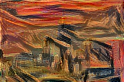
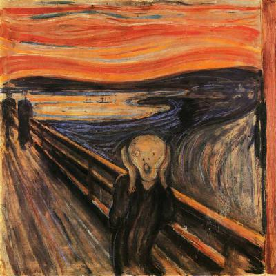

# Style Transfer in Keras

This is a Keras implementation of [A Neural Algorithm of Artistic Style](https://arxiv.org/abs/1508.06576) by Leon A. Gatys, Alexander S. Ecker and Matthias Bethge.

<p align="center">
 
   
   
</p>

Neural Styler lets you create artistic images by combining a base picture with the style of another. The images above show multiple iterations of a photo of the [Chicago skyline](http://www.nursing.uic.edu/sites/default/files/chicagoskyline_2.jpg) that has been combined with Edvard Munch's [The Scream](https://en.wikipedia.org/wiki/The_Scream). 

## Implementation Details

## Documentation

Use `generate.py` to style an image. Example usage:

```
python generate.py \
examples/bases/chicago.jpg \
examples/styles/umbrella_girl.jpg \
examples/results/my_result \
--width=400
```

## Requirements

- Keras (and associated requirements)
- Python 2.7

## Attribution

- This implementation uses some code from Francois Chollet's [Neural Style Transfer](https://github.com/fchollet/keras/blob/master/examples/neural_style_transfer.py).
- The hierarchy also borrows from Giuseppe's gist which you can view [here](https://gist.github.com/giuseppebonaccorso/ef09a03424c9a49ae9b087bd364a5813).

