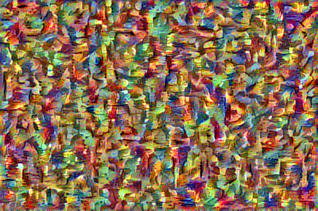
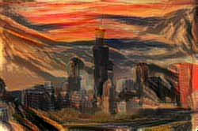

# Style Transfer in Keras

This is a Keras implementation of [A Neural Algorithm of Artistic Style](https://arxiv.org/abs/1508.06576) by Leon A. Gatys, Alexander S. Ecker and Matthias Bethge.

<div align='center'>

</div>

<div align = 'center'>




<br>


</div>

Neural Styler lets you create artistic images by combining a base picture with the style of another. For example, the images above show multiple iterations of the [Chicago skyline](http://www.nursing.uic.edu/sites/default/files/chicagoskyline_2.jpg) combined with Edvard Munch's [The Scream](https://en.wikipedia.org/wiki/The_Scream) and Leonid Afremov's [Rain Princess](https://afremov.com/RAIN-PRINCESS-Palette-knife-Oil-Painting-on-Canvas-by-Leonid-Afremov-Size-30-x30.html) respectively.

## Implementation Details

`Neural_Styler` is the class abstraction which defines the loss and optimization.

## Documentation

Use `generate.py` to style an image. Example usage:

```python
python generate.py examples/bases/chicago.jpg examples/styles/umbrella_girl.jpg examples/results/my_result
```

## Requirements

- Keras (and associated requirements)
- Python 2.7

## Attribution

- This implementation uses some code from Francois Chollet's [Neural Style Transfer](https://github.com/fchollet/keras/blob/master/examples/neural_style_transfer.py).
- The hierarchy also borrows from Giuseppe's gist which you can view [here](https://gist.github.com/giuseppebonaccorso/ef09a03424c9a49ae9b087bd364a5813).

